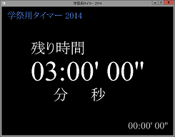

学祭用タイマー 2014
-------------------



Ruby を使って書かれたカウントダウン / カウントアップタイマーです。描画に SDL を使っているため、クロスプラットフォームで動作します。

## 配布バイナリ 対応環境

- Windows XP / 7 / 8 / 8.1

## ダウンロード
ビルド後のファイルをリリースページからダウンロードできます。解凍後、timer.exe より起動できます。

## 操作方法

|キーボード入力|操作                                  |
|--------------|--------------------------------------|
|Enter         |タイマーの開始・停止・クリア          |
|R             |経過時間・残り時間の表記を反転        |
|Escape        |終了                                  |
|F11           |全画面モード・ウィンドウモード切り替え|
|F5            |設定ファイルのリロード                |

## 設定
`setting.ini` をテキストエディタで編集してください。

## 開発環境

- Ruby 1.8x / 1.9x
- StarRuby

## 実行, デバッグ
コンソールから以下のコマンドで実行できます。

```
$ ruby timer.rb
```

## ビルド
Ocra を使って .exe ファイルへビルドできます。以下のコマンドを実行すると、timer.exe へ出力されます。

```
$ ocra --windows timer.rb
```

## 依存ツール, ライブラリのインストール方法
以下は、Windows で動作させる場合の記述です。

### Ruby 1.9
実行、及びビルドする際に必要です。[RubyInstaller for Windows](http://rubyinstaller.org) より Ruby 1.9 系列をダウンロードしてください。

以下は Ruby 1.9.3-p551 の場合です。PATH は事前に通してください。

```
$ ruby -v
ruby 1.9.3p551 (2014-11-13) [i386-mingw32]
```

### StarRuby
実行、及びビルドする際に必要です。[Google Code](https://code.google.com/p/starruby/downloads/list) より `starruby-0.3.3-win32-ruby19.zip` をダウンロードします。インストールは、解凍後のディレクトリで以下のコマンドで可能です。

```
$ ruby install.rb
install.rb:8: Use RbConfig instead of obsolete and deprecated Config.
install -c dll/libfreetype-6.dll C:/tools/Ruby193/bin
install -c dll/libogg-0.dll C:/tools/Ruby193/bin
install -c dll/libpng12-0.dll C:/tools/Ruby193/bin
install -c dll/libvorbis-0.dll C:/tools/Ruby193/bin
install -c dll/libvorbisfile-3.dll C:/tools/Ruby193/bin
install -c dll/SDL.dll C:/tools/Ruby193/bin
install -c dll/SDL_mixer.dll C:/tools/Ruby193/bin
install -c dll/SDL_ttf.dll C:/tools/Ruby193/bin
install -c dll/smpeg.dll C:/tools/Ruby193/bin
install -c ext/starruby.so C:/tools/Ruby193/lib/ruby/site_ruby/1.9.1/i386-msvcrt
Installation Star Ruby completed!
```

### ocra
ビルドする際に用います。Ruby のインストール後に、`gem` でインストールします。

```
$ gem install ocra
$ ocra --version
Ocra 1.3.4
```

SSL のエラーが発生する場合、以下を参考に証明書を追加してください。

- [Windowsでgem installするとSSLエラーが出る場合の解決策](http://qiita.com/shimoju/items/394818b4989b94680aaf)

## ライセンス
MIT License<br />
Copyright (C) 2011-2012, 2014 Pine Mizune